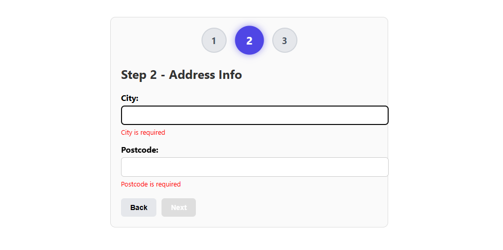
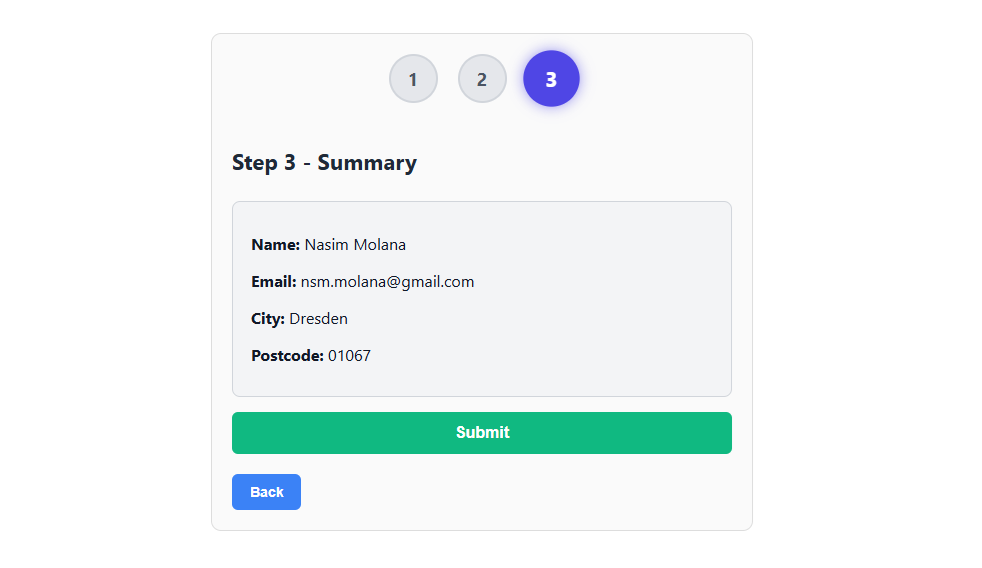
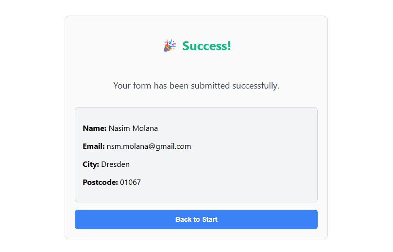

<<<<<<< HEAD
# Multi-Step Form (React)

A modern and responsive Multi-Step Form built with React, featuring step validation, smooth animations, a visual progress bar, and clean component architecture. 
Includes WCAG-friendly accessibility features, mobile optimization, and a polished user experience.
---

## 🚀 Live Demo
https://multi-step-form.vercel.app

---

## 📸 Screenshots

### Step 1 – User Info


### Step 2 – Address


### Step 3 – Summary


### Step 4 – Summary


---

## ✨ Features

- Multi-step navigation (Next / Back)
- Progress indicator with active state
- Smooth fade-in animation between steps
- Controlled form inputs
- Validation for:
  - Required fields
  - Email format
  - City starts with a letter
- Auto-focus on each step's first field
- Submit button with loading state
- Clean and responsive UI

---

## 🛠️ Technologies Used

- React
- JavaScript (ES6+)
- CSS / Animations
- Vercel (Deployment)

---
## 📂 Folder Structure

multi-step-form/
├── public/
│   ├── index.html
│   ├── favicon.ico
│   └── screenshots/
│       ├── step1.png
│       ├── step2.png
│       └── step3.png
│
├── src/
│   ├── components/
│   │   ├── Step1.js
│   │   ├── Step2.js
│   │   ├── Step3.js
│   │   ├── Step4.js
│   │   └── ProgressBar.js
│   │
│   ├── styles/
│   │   ├── App.css
│   │   ├── ProgressBar.css
│   │   ├── Step3.css
│   │   ├── Step4.css
│   │   └── animations.css
│   │
│   ├── App.js
│   ├── index.js
│   └── index.css
│
├── .gitignore
├── package.json
└── README.md

---

## 🧩 Installation & Running Locally

```bash
git clone https://github.com/YOUR_USERNAME/multi-step-form.git
cd multi-step-form
npm install
npm start


This will run the project on:

http://localhost:3000


📦 Deployment

This project is deployed on Vercel.

To deploy your own version:

1. Push your code to GitHub  
2. Go to https://vercel.com  
3. Import your repository  
4. Deploy with default settings  


🤝 Contributions

Contributions, issues, and suggestions are welcome!


📄 License

This project is open-source and available under the MIT License.
=======
# multi-step-form
A modern multi-step React form with validation, animations, progress bar, and full responsive design.
>>>>>>> 3ec5e18a52db73ac95071278d093062b4b80c9e9
